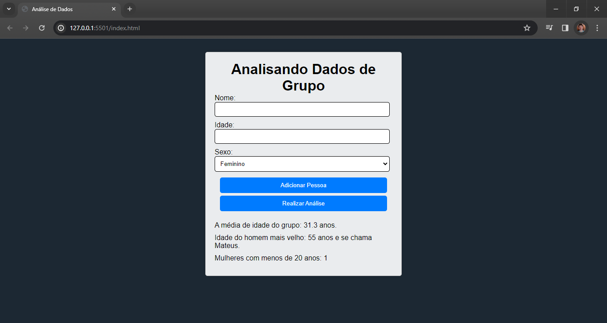

# Análise de Dados 📊

Bem-vindo ao projeto de Análise de Dados! Este projeto utiliza HTML, CSS e JavaScript para realizar análises estatísticas simples com base em dados fornecidos pelo usuário. 🚀

## Tecnologias Utilizadas

- **HTML:** Linguagem de marcação para estruturação e organização do conteúdo da página.
- **CSS:** Estilização para tornar a interface do usuário mais atraente e responsiva.
- **JavaScript:** Linguagem de programação utilizada para manipular os dados, realizar cálculos e exibir resultados dinâmicos na página.

## Funcionalidades

Este projeto oferece as seguintes funcionalidades:

- **Adicionar Pessoa:** Permite ao usuário inserir informações sobre uma pessoa, como nome, idade e sexo.
- **Realizar Análise:** Calcula a média de idade do grupo, identifica a idade do homem mais velho e contabiliza o número de mulheres com menos de 20 anos.

## Como Utilizar o Projeto

1. Preencha os campos de nome, idade e sexo da pessoa a ser adicionada.
2. Clique no botão "Adicionar Pessoa" para incluir os dados.
3. Após adicionar todas as pessoas desejadas, clique no botão "Realizar Análise" para calcular as estatísticas.
4. Os resultados serão exibidos abaixo do botão, mostrando a média de idade do grupo, a idade do homem mais velho e o número de mulheres com menos de 20 anos.

  

## Contribuições

Contribuições são bem-vindas! Sinta-se à vontade para melhorar a interface, adicionar novas funcionalidades ou otimizar o código JavaScript.
